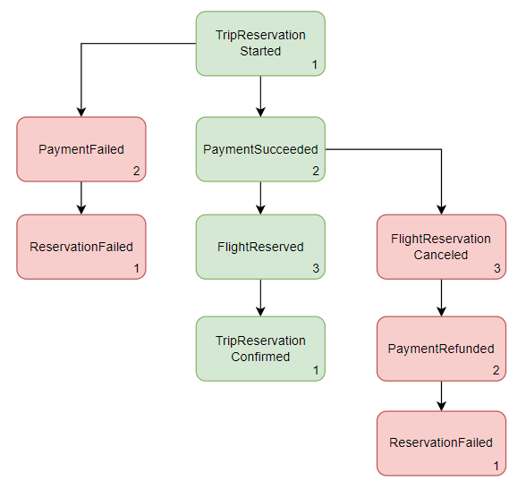
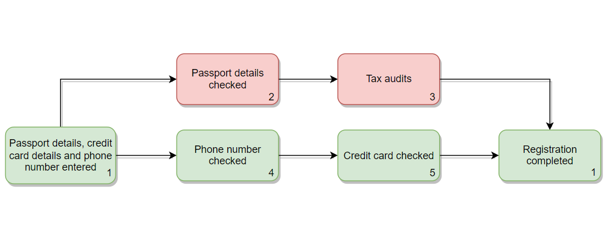

## **Пример использования реализации паттерна Сага**

### **Введение в Саги**

Один из недостатков микросервиской архитектуры связан с реализацией транзакций, охватывающих несколько сервисов. Так, если в монолитной архитектуре функциональность *ACID*-транзакций полностью обеспечивается СУБД, то в микросервисной архитектуре, при использовании модели *“Database per service”*, необходимо использовать более продуманный механизм работы с транзакциями.

И паттерн Сага – как способ организации транзакций в распределённой системе, является хорошим решением в такой ситуации. Само определение Саги звучит так – *последовательность локальных транзакций, которые координируются посредством асинхронных сообщений.* Т.е. каждый сервис, после выполнения своей части распределённой транзакции и фиксации этого в своей локальной базе данных, публикует событие, на основе которого действуют следующие участники Саги.

Если в *ACID*-транзакциях, в случае неудачи, для обеспечения атомарности, будет автоматически выполнена команда *rollback*, то при использовании паттерна Сага для этого нужно написать соответствующие компенсирующие транзакции, которые должны откатить уже сделанные изменения. Далее это будет подробнее рассмотрено на примерах.

Паттерн Сага можно реализовать двумя способами – *оркестрационным* и *хореографическим*. В реализации библиотеки используется хореографический подход – это когда не предусматривается центрального координатора, который выдает участникам команды, вместо этого участники подписываются на события друг друга и реагируют соответствующим образом. Также хореографическую Сагу можно назвать динамической, потому что в ней нет централизованного места, где можно посмотреть, какие сервисы являются участниками какой-то распределённой транзакции, а также потому что сама Сага может постоянно меняться.

### **Реализация Саги в библиотеке**
Теперь можно посмотреть, как это всё реализовано в библиотеке.
Взаимодейсвие с Сагами выполняются с использованием `SagaManager`. По умолчанию все инструменты для взаимодействия с Сагами включены, но если вы хотите сделать свою реализацию, то в конфигурации можно выключить встроенную реализацию паттерна Сага: `event.sourcing.sagas-enabled=false`

Для того, чтобы запустить Cагу нужно создать шаг Саги. Сделать это можно с помощью вызова метод `launchSaga` у `SagaManager`, передав `sagaName` - название этого процесса и `stepName` - название текущего шага. И после выполнения этого метода получить `SagaContext` - результат выполнения шага Саги и передать его при обновлении агрегата.

Внутри `SagaManager`, если это первый шаг, происходит создание `SagaContext` – класса, который содержит в себе метаданные для определённого шага Саги. В эти метаданные входят уже ранее описанные `sagaName` и `stepName` которые задаются пользователем, но, помимо этого, также `sagaStepId` – идентификатор шага Саги и `sagaInstanceId` – идентификатор самой Саги, который будет общим для одной конкретной распределённой транзакции. И эти метаданные (`SagaContext`) передаются вместе с ивентом, на который подписывается следующий сервис в цепочке Саги. Этот сервис может извлечь эти метаданные, и продолжить выполнение Саги. Также, для того чтобы можно было отследить какое событие следовало за каким, SagaContext включает в себя `prevStepsIds/correlationId` – идентификаторы предыдущих или одного предыдущего шага Саги. Следующая картинка примерно демонстрирует, как эти метаданные передаются от одного сервиса к другому.
 

На код, который сделан по этой картинке можно посмотреть по этой **_ссылке: …_** Но там это немного упрощено.
Вот как выглядит по ивентам сценарии выполнения Саги в этом примере:

Успешный сценарий выделен зелёным цветом, неудачный – красным. Если одна из транзакций Саги завершилась неудачей, то необходимо запустить логику **компенсирующих** транзакций для сохранения согласованности в системе. В библиотеке компенсирующие транзакции задаются также, как и обычные. Т.е. в случае ошибки, необходимо создать ивент, на основе которого будут действовать сервисы, которые были предыдущими в цепочке транзакций.

Если в вашей бизнес логике необходимо, чтобы Сага исполнялась не только последовательно, а ещё и **параллельно**, т.е. когда для продолжения какого-то шага необходимо дождаться завершения несколько предыдущих, то вы можете передать в метод `witchContextGiven` несколько `sagaContext` путём их складывания. Пример с параллельными шагами Саги можно посмотреть по этой **_ссылке: …_**
Вот как выглядит сценарий выполнения этой Саги:

В примере, т.к. необходимо дождаться двух ивентов в сервисе аккаунтов, создаётся проекция `aggregation-example`, у которой id – это id Саги. В ней содержится некоторая информация из двух ивентов, которая необходима для продолжения Саги. Когда приходит один из ивентов, то проверяется, существует ли проекция с таким id Саги, если нет, то просто сохраняется информация о первом ивенте. Но в случае, когда проекция уже существует, то на основе данных из этой проекции продолжается выполнение Саги. У такого ивента, который был создан на основе двух предыдущих шагов, в `prevStepsIds`, соответственно, будет два id шагов Саги.

Если вам необходимо обособить несколько шагов внутри одной Саги, т.е. создать **вложенную Сагу**, то вы можете сделать это следующим образом, как в этом примере: **_ссылка…_**
Вот как выглядит сценарий выполнения Саги для этого примера:

Основная Сага будет включать в себя все эти шаги, но во вложенной будет содержаться только два шага, выделенных красным цветом.
Создание вложенной Саги `NESTED_SAGA_EXAMPLE`, параллельно продолжение основной `SAGA_EXAMPLE`, происходит в `Service2`, в `Service3` идёт второй шаг. 

Также есть возможность использовать более **упрощённую схему** использования паттерна Сага, без `SagaManager`. Тогда у Саги и её шагов не будет названий. Для этого при обновлении агрегата достаточно передать `SagaContext` предыдущего ивента. Пример такой Саги можно посмотреть по этой **_ссылке: …_**
При таком способе использования паттерна нельзя будет создавать вложенные Саги и параллельные шаги, а также отслеживать время обработки каждого шага.

### **Проекции по Сагам**

Для того, чтобы разобраться, как стояться проекции, необходимо немного понимать, как работают некоторые процессы внутри библиотеки, связанные с Сагами.

Для локального хранения информации о Сагах, используется агрегат `SagaStepAggregate`.
У этого агрегата есть 4 ивента:
- `launchSagaStep` - информирует о том, что был **инициирован** первый шаг Саги, но он ещё не был обработан.
- `initiateSagaStep` - информирует о том, что был **инициирован** последующий шаг Саги, но он ещё не был обработан.
- `processSagaStep` - информирует о том, что шаг Саги был **обработан** и сохранён в `EventStore`.
- `processDefaultSaga` - информирует о том, что шаг Саги по умолчанию был обработан.

Все эти события сохраняются в таблицу `sagas`.

Также в библиотеке есть отдельный *event-stream* - `SagaEventStream` для работы с Сагами. Он необходим, чтобы отслеживать, что событие Саги было успешно обработано и записано в БД. Этот event-stream подписывается на события **всех** агрегатов и ищет в них *мета-информацию*, связанную с Сагами. После этого передаёт команды в `SagaStepAggregate`, которые публикуют ивенты `processSagaStep` или `processDefaultSaga`.

Так, с помощью `SagaManager` фиксируется факт начала обработки шага Саги, а с помощью `SagaEventStream` - то, когда событие было уже успешно обработано.

Важно отметить, что для упрощённого варианта использования Саг ивенты `launchSagaStep` и `initiateSagaStep` не публикуются, т.к. не используется `SagaManager`.

Для отслеживания Саг в библиотеке уже есть готовый сервис из модуля `tiny-event-sourcing-sagas-projections`.
Этот сервис подписывается на события локальных агрегатов саг `SagaStepAggregate` и создаёт таблицы `sagas-projections` для расширенного варианта и `sagas-default-projections` для упрощённого. С помощью этого сервиса можно в одном месте отследить все Саги, которые есть в системе.

В проекции для каждой Саги создаётся свой документ, где отображается id, sagaName и все шаги этой Саги. В sagaSteps помимо stepId, prevStepsId и stepName есть время, когда начался процесс обработки шага, и когда он уже был успешно завершён, а также название ивента, к которому относиться этот шаг. Всю последовательность шагов можно отследить по `stepId` и `prevStepsId`. Также там реализована простая сортировка по `stepId` и `prevStepsId`.

Если вам нужно создать свой сервис для отслеживания Саг, то вы можете сделать это по примеру этого готового сервиса.
